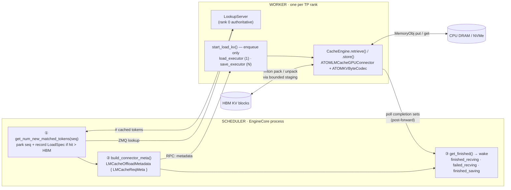
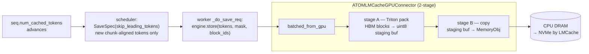
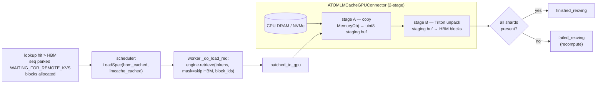
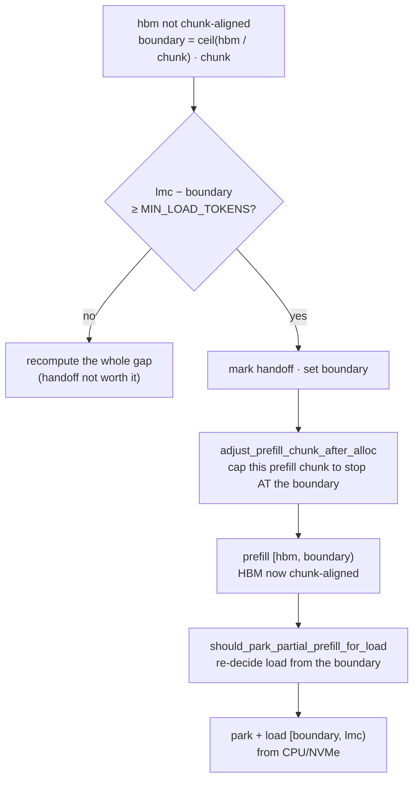

# LMCache CPU/NVMe KV Cache Offload (ATOM standalone)

This module adds a **CPU DRAM (L2) and optional NVMe (L3) KV-cache tier** on top
of ATOM's native HBM prefix cache. When a request's prompt prefix has been
evicted from HBM but still lives in CPU/NVMe, the connector **reloads** those KV
blocks instead of recomputing them — turning a full prefill into a host→GPU copy.
This raises effective cache hit rate and concurrency for prefix-heavy workloads
(multi-turn agentic serving, long shared system prompts).

It is the **ATOM-native, in-engine** offload path: the connector plugs straight
into ATOM's scheduler/worker via the shared
[`KVConnectorFactory`](../disaggregation/factory.py), with no vLLM in the loop.
For the **vLLM-plugin** offload path (LMCache driven through vLLM's own connector
API), and for the LMCache-from-source ROCm build steps both paths need, see
[`recipes/atom_vllm/LMCache-KV-Cache-Offload.md`](../../../recipes/atom_vllm/LMCache-KV-Cache-Offload.md).

New to this module? Read top to bottom: the early sections give the big picture;
the byte-level deep dives ([Key Modules](#key-modules-in-depth),
[Relationship to LMCache](#relationship-to-lmcache-reuse-vs-override)) come later.
Unfamiliar terms are in the [Glossary](#glossary).

## Design at a Glance

Two ideas carry the whole module:

1. **LMCache owns the storage tier; ATOM owns the GPU layout.**
   We drive LMCache's `CacheEngine.store()` / `CacheEngine.retrieve()` so LMCache
   keeps doing what it is good at — chunking (256-token chunks), key generation,
   lookup pins, CPU/NVMe storage-manager put/get, eviction. But LMCache's stock
   GPU connectors can only express **token-major** KV (`KV_2LTD` etc.). ATOM's
   AITER attention stores K **x-packed and head-major** (`K=(nb,H,D//x,bs,x)`,
   `x = 16 // elem`) and V strided (`nb,H,D,bs`). So we hand LMCache an
   ATOM-owned `GPUConnectorInterface` that moves **opaque per-block bytes**
   (`ATOMKVByteCodec`) — a byte-identical round-trip the attention kernel reads
   back in its own layout. LMCache never needs to understand the layout.

2. **Copies run off the RPC thread, after `forward`.**
   `start_load_kv` only `submit`s to a copy daemon and returns immediately, so the
   worker RPC thread stays free to run `forward`. Completions are polled in
   `get_finished` post-forward. This is the fix for the classic "loading KV
   blocks/starves the running prefill" coupling.

## Module Map

| File | Role |
|------|------|
| `__init__.py` | Registers the `lmcache_offload` backend with `KVConnectorFactory`. |
| `connector.py` | The two halves: `LMCacheOffloadConnectorScheduler` (EngineCore process) and `LMCacheOffloadConnector` (worker). The core orchestration. |
| `config.py` | Builds the per-rank `LMCacheEngineConfig` + `LMCacheMetadata` from `LMCACHE_*` env and `kv_transfer_config` extras. |
| `metadata.py` | `ATOMRawBytesLMCacheMetadata` (opaque uint8 allocation) + per-request transfer descriptors (`LoadSpec`, `SaveSpec`, `LMCacheReqMeta`, `LMCacheOffloadMetadata`). |
| `atom_kv_byte_codec.py` | `ATOMKVByteCodec`: maps a token range → AITER KV blocks and packs/unpacks them as raw bytes. The layout-bridging core. |
| `atom_lmcache_gpu_connector.py` | `ATOMLMCacheGPUConnector`: LMCache `GPUConnectorInterface` impl. Bounded GPU staging + two-stage (pack ↔ copy) pipeline. |
| `atom_lmcache_staging.py` | Per-thread CUDA streams, staging buffer, ready/free events, env helpers. |
| `triton_kv_staging.py` | Triton fused chunk-major pack/unpack kernels (the fast staging path). |

## Architecture

The connector is split across two processes, mirroring ATOM's P/D split:



### Scheduler side (`LMCacheOffloadConnectorScheduler`)

Runs in the EngineCore process. It decides **what** to load/save; it never
touches GPU memory.

- **`get_num_new_matched_tokens(seq)`** — on a new request, queries the worker's
  `LookupServer` over ZMQ for how many prompt tokens LMCache holds. If the hit
  exceeds what HBM already has, it records a `LoadSpec` and returns
  `(need, True)` to **park the sequence** in `WAITING_FOR_REMOTE_KVS`.
- **`update_state_after_alloc` / `should_park_for_load_after_alloc`** — after
  block allocation, re-reads the *real* HBM-cached count (the lookup ran before
  the HBM prefix match, so `num_cached_tokens` was stale). Loads only the gap
  `[hbm_cached, lmcache_hit)`, chunk-aligned, and only if it clears
  `OFFLOAD_MIN_LOAD_TOKENS`. Loading below the HBM floor would overwrite shared
  prefix-cache blocks → output corruption, so that floor is strict.
- **`build_connector_meta()`** — emits one `LMCacheReqMeta` per load/save into
  `LMCacheOffloadMetadata`, the snapshot forwarded to the worker each step.
  Saves walk a persistent `_save_tracker` that stores newly-computed prompt
  chunks as the computed frontier (`num_cached_tokens`) advances.
- **Save/free coordination** — `should_defer_free` holds blocks until their
  in-flight save lands; `save_finished` / `load_failed` reconcile the trackers
  (a failed load lowers the save floor so the recomputed chunks get persisted).

### Worker side (`LMCacheOffloadConnector`)

Runs in each TP-rank worker. It does the actual byte movement.

- **`register_kv_caches`** — builds the `ATOMKVByteCodec` over the registered KV
  tensors, the LMCache engine, and (on rank 0) the `LookupServer`.
- **`start_load_kv(metadata)`** — *enqueue only*. For each request, `submit`s a
  load to `_load_executor` and/or a save to `_save_executor`, then returns. **No
  copy happens on the RPC thread.**
- **`_do_load_req` / `_do_save_req`** — run on the daemon threads. They call
  `engine.retrieve()` / `engine.store()`, which flow through the ATOM GPU
  connector. Loads are all-or-nothing per shard: a missing shard fails the load
  and the scheduler recomputes.
- **`get_finished()`** — polled post-forward; returns completion sets that the
  scheduler turns into wakes (see protocol below).

## Request Lifecycle

Following one request end to end ties the pieces together:

1. **Lookup.** A new request arrives; the scheduler's
   `get_num_new_matched_tokens` asks the rank-0 `LookupServer` over ZMQ how many
   prompt tokens LMCache holds. If that hit exceeds the HBM prefix cache, it
   records a `LoadSpec` and **parks** the sequence in `WAITING_FOR_REMOTE_KVS`.
2. **Decide.** After blocks are allocated, `_decide_load_after_alloc` re-checks the
   *real* HBM floor and chooses load vs. recompute (see
   [When Does a Reload Actually Happen?](#when-does-a-reload-actually-happen)).
3. **Enqueue.** `build_connector_meta` emits an `LMCacheReqMeta`; the worker's
   `start_load_kv` submits the load to the load daemon and returns — the RPC
   thread stays free to run `forward`.
4. **Move.** The daemon runs `engine.retrieve`, which drives
   `ATOMLMCacheGPUConnector`: MemoryObj → staging buffer → HBM blocks (Triton
   unpack), bit-identical.
5. **Wake.** Post-forward, `get_finished` returns `finished_recving` (success) or
   `failed_recving` (recompute). The scheduler wakes the seq, which prefills only
   the still-uncached **suffix**.
6. **Save.** As prefill computes new chunks, the scheduler emits saves; the save
   daemon stores them fire-and-forget to CPU/NVMe. Blocks whose free was deferred
   are released on `finished_saving`.

## Completion Protocol

Offload extends the P/D completion states. The mapping is the crux of
correctness — note the deliberate asymmetry vs a P/D producer:

| Worker set | Scheduler effect |
|------------|------------------|
| `finished_recving` | Load succeeded → wake the parked seq and run it. |
| `failed_recving`   | Load failed → wake the seq to **recompute** into its already-allocated blocks. |
| `finished_saving`  | Fire-and-forget save landed → release blocks whose free was deferred. |
| `finished_sending` | **Never used.** A P/D producer reports this and the scheduler *frees* the blocks — which would deallocate live offload blocks. Hence `is_producer = False`. |

`is_offload = True` on the scheduler opts into offload-wake (suffix prefill)
rather than the P/D decode-jump in `Scheduler.schedule()`.

## Save / Load Data Flow

**Save (HBM → CPU/NVMe), fire-and-forget after a prefill chunk computes:**



**Load (CPU/NVMe → HBM), on the TTFT critical path:**



The GPU connector uses a **bounded** staging buffer
(`OFFLOAD_GPU_STAGING_CHUNKS` chunks, default 2) and a two-stage pipeline: while
one group copies host↔staging, the next packs/unpacks on a separate CUDA stream,
handed off via ready/free events. Transfers larger than the buffer are split into
groups, so HBM staging cost is capped regardless of prefix length.

**`OFFLOAD_GPU_STAGING_CHUNKS` sizes *each* staging buffer, and there is more than
one.** The buffer is thread-local (`threading.local`), and load and save run on
separate executors (§ worker side). So the **load path** owns one staging buffer
and the **save path** owns one per save worker — they are never shared. Resident
staging HBM is therefore:

```
staging_chunk_bytes = (LMCACHE_CHUNK_SIZE / block_size) * bytes_per_block
per_buffer_bytes    = OFFLOAD_GPU_STAGING_CHUNKS * staging_chunk_bytes
resident_HBM        ≈ (1 load + OFFLOAD_COPY_WORKERS save) * per_buffer_bytes
```

For the chunk2 run that is `2 * 16.76 MiB ≈ 33.5 MiB` per buffer × (1 load + 1
save) ≈ **67 MiB** total. Raising `OFFLOAD_GPU_STAGING_CHUNKS` speeds up transfers
but multiplies *both* buffers.

## When Does a Reload Actually Happen?

A lookup hit does **not** guarantee a reload. After block allocation,
`_decide_load_after_alloc` re-checks the *real* HBM-cached count and picks one of
the outcomes below. Everything is quantized to the LMCache chunk (256 tokens) —
KV is only ever loaded/saved on chunk boundaries, because that is the granularity
of an LMCache key.

| Situation (`hbm` = HBM-cached, `lmc` = lookup hit, `chunk` = 256) | Outcome |
|---|---|
| `lmc <= hbm` | `hbm_satisfies_after_alloc` — HBM already covers the hit; **no load**. |
| `hbm` not a multiple of `chunk` | `unaligned_hbm_prefill` — takes the **handoff** path (always on, see below): recompute up to the chunk boundary, then load the rest. |
| `lmc - hbm < OFFLOAD_MIN_LOAD_TOKENS` (default 8192) | `too_small` — reload cheaper to skip; **recompute**. |
| `hbm` aligned **and** gap large enough | `aligned_large_hit` — **load** `[hbm, lmc)` from CPU/NVMe. |

Two hard rules behind the table:

- **Never load below the HBM floor.** The lookup runs *before* the HBM prefix
  match, so the recorded `hbm_cached_tokens` is stale (often 0). We always reload
  using the post-allocation `num_cached_tokens` as the floor — loading underneath
  it would overwrite prefix-cache blocks that may be shared with other sequences,
  corrupting their output.
- **Worker re-checks alignment too.** If a load request still arrives with an
  unaligned HBM prefix, `_do_load_req` refuses it (`failed_recving` → recompute)
  rather than write a misaligned chunk.

### Unaligned HBM: prefill to the chunk boundary first, then load

When the HBM prefix is *not* chunk-aligned, the gap `[hbm, lmc)` cannot be loaded
directly (a chunk would straddle the boundary). The connector **always** does the
handoff (the `OFFLOAD_UNALIGNED_HANDOFF` switch was removed; it is now
unconditional) — **compute the short stretch up to the next chunk boundary, then
reload the rest:**



So the handoff splits the request: a tiny recomputed segment to reach alignment
(≤ one chunk), followed by a large reload — only taken when the post-boundary
remainder still clears `OFFLOAD_MIN_LOAD_TOKENS`, otherwise plain recompute wins.

### Save alignment

Saves are always chunk-aligned for the same reason. As prefill computes chunks,
the scheduler stores each newly-completed, chunk-aligned stretch
(`SaveSpec.skip_leading_tokens` floored to `chunk`). The **unaligned tail** of a
prompt is only stored on the request's final prefill step (`is_last_prefill`),
so a partial trailing chunk is never persisted mid-prefill.

## Correctness, fp8 & Failure Handling

KV offload is unforgiving — a single mis-placed byte corrupts a model's output
silently. The design leans on a few hard invariants.

### Byte-identical round-trip

The codec moves **opaque bytes**, never re-interpreted values, so a block written
to CPU/NVMe and read back is bit-for-bit what the attention kernel wrote. This is
what lets us bypass LMCache's layout assumptions entirely. The round-trip
(including the fp8 path below) is verified to be byte-identical in
`tests/test_lmcache_offload_connector.py`.

### fp8 KV and per-block scales

Under `--kv_cache_dtype fp8`, each KV block carries its own `k_scale` / `v_scale`.
`ATOMKVByteCodec` enumerates **four** segments per layer when present — `k_cache`,
`v_cache`, `k_scale`, `v_scale` — and moves them all as part of one block's bytes
(`atom_kv_byte_codec.py`). The scales travel with the quantized data, so a
reloaded fp8 block dequantizes identically; no scale is recomputed or dropped.

### Invariants enforced in code

| Invariant | Where | Why |
|-----------|-------|-----|
| `chunk_size % block_size == 0` | `metadata.py`, `atom_lmcache_gpu_connector.py` ctor | An LMCache chunk must map to a whole number of ATOM blocks, or a chunk would straddle a block boundary. |
| Never load below the HBM floor | scheduler `_decide_load_after_alloc` | Loading under `num_cached_tokens` overwrites prefix-cache blocks shared with other seqs → corruption. |
| Load is all-or-nothing per shard | worker `_do_load_req` | A half-loaded prefix is worse than none; a missing shard fails the whole load → recompute. |
| Chunk-aligned load/save only | scheduler + worker | LMCache keys are per-chunk; an unaligned write has no valid key. |

### Failure handling

Every failure degrades to "lose this offload opportunity," never to a hang or a
corrupt write:

- **Save fails** — `_guard` marks the request `done_save` (instead of leaving its
  blocks pinned forever); the request simply isn't persisted this time.
- **Load fails / misses** — the worker reports `failed_recving`; the scheduler
  wakes the seq to **recompute** into its already-allocated blocks, and
  `load_failed` lowers the save floor so the recomputed `[hbm, lmc)` chunks get
  stored again rather than being treated as already-persisted.
- **Request aborts mid-save** — `should_defer_free` holds the blocks until the
  in-flight save lands (`finished_saving`), so a save never reads freed memory.
- **Lookup server unavailable** — `register_kv_caches` logs a warning and runs
  save-only; loads are simply never offered (lookup returns no hits).

## TP > 1 Notes

- **Lookup is rank-0-authoritative** (`cfg.lookup_server_worker_ids = [0]`). The
  connector saves on **all** ranks in lockstep, so rank 0's "is it offloaded?"
  answer is correct for the whole group; each rank then loads its own KV shard.
  Without this, the client took `min()` over per-rank lookups and a single rank
  returning 0 made the scheduler always recompute.
- **Load is all-or-nothing.** If any rank's shard is missing, `_do_load_req`
  reports `failed_recving` and the scheduler recomputes — no half-loaded state.

## Key Modules in Depth

`connector.py` (the scheduler/worker orchestration) is covered under
[Architecture](#architecture). The rest of this section details the
**byte-movement stack** — the part that makes ATOM's KV layout work with LMCache —
and the two support files.

### `atom_kv_byte_codec.py` — the layout bridge

This is the keystone. The two sides store KV in incompatible layouts:

**What LMCache expects — token-major.** Its GPU connectors only accept the clean
NHD/HND family (`KV_2LTD` etc.), i.e. KV indexed roughly as
`[layer, k/v, token, head, head_dim]`, contiguous in `head_dim` then token.
`normalize_kv_and_discover_format` rejects anything else.

**What AITER actually stores — x-packed, head-major, paged.** Per layer
(`bs` = block size, `H` = local KV heads, `D` = head dim, `x = 16 // elem_bytes`,
so `x=16` for fp8 / `x=8` for bf16):

| Tensor | Shape | Notes |
|--------|-------|-------|
| `k_cache` | `(num_blocks, H, D//x, bs, x)` | head-major; `D` split into `D//x` outer × `x` inner, with `bs` between → not token-contiguous |
| `v_cache` | `(num_blocks, H, …, bs, …)` | strided, head-major (exact split is model-dependent) |
| `k_scale`, `v_scale` (fp8) | `(num_blocks, H, bs)` | one fp32 scale per (head, token) in a block |

This is a **persistent HBM storage layout** (not the transient LDS bank "swizzle"),
and is specific to this ATOM AITER path — stock vLLM's `rocm_aiter_fa` uses the
clean token-major `(2,nb,bs,H,D)` that LMCache handles natively.

**How the bridge works — gather/scatter of opaque bytes, no transcode.** The codec
never reinterprets values. A whole *block* of any of those tensors
(`tensor[block_id]`) is contiguous in memory, so one block's KV is just a set of
contiguous byte slices (per layer: K, V, and fp8 scales). The codec gathers the
blocks of an LMCache chunk into a **chunk-major `uint8`** buffer —
`[chunk: seg0 blocks | seg1 blocks | …]` — which LMCache stores as an opaque blob;
on reload it scatters the exact bytes back to the exact block slots. The only
transformation is *which bytes land where* (a paged-block gather into contiguous
chunk order), never the bit pattern — so the round-trip is byte-identical and the
AITER kernel reads back its native layout. LMCache only ever sees a `uint8` array
keyed per chunk; it needs to know nothing about `x`, heads, or paging.

**Three terms that make the rest precise:**

- **segment** — one movable per-layer KV tensor. The codec enumerates, for every
  layer, up to four: `k_cache`, `v_cache`, and (fp8) `k_scale`, `v_scale`. Flattened
  across all layers this is one ordered list — an N-layer fp8 model has `4N`
  segments (`2N` for bf16). The codec is deliberately agnostic to which kind a
  segment is; it only requires a `[num_blocks, …]` tensor whose per-block slice is
  contiguous. `seg_block_bytes = segment[0].numel() × elem_size`.
- **block** — one slot on a segment's dim 0: `segment[block_id]`, a contiguous byte
  run. `bytes_per_block` = Σ `seg_block_bytes` over all segments (one block across
  every layer/tensor).
- **MemoryObj** — LMCache's storage unit for one chunk. Here it is **not** a typed
  KV tensor but a flat, contiguous `uint8` blob of `nblocks × bytes_per_block`
  bytes (`nblocks = chunk_size / block_size`). The honest `MemoryFormat` for raw
  bytes would be `BINARY`, but LMCache's LocalCPU allocator rejects `BINARY` for a
  normal MemoryObj allocation. So we set `engine.fmt = KV_2LTD` — any format the
  allocator *accepts* — purely to pass that check; the value is otherwise inert,
  because `ATOMRawBytesLMCacheMetadata` already overrides `get_shapes`/`get_dtypes`
  to force a flat `uint8` of exactly this size. The buffer you get is the opaque
  blob we want regardless of `fmt`. Internally it is **segment-major, then
  block-major**:

  ```
  one MemoryObj  (= 1 chunk = nblocks blocks):
    [ L0.K : blk0 blk1 … blk_{n-1} ]   each blk = seg_block_bytes, raw AITER bytes
    [ L0.V : blk0 … blk_{n-1} ]
    [ L0.kS: blk0 … blk_{n-1} ]        (fp8 only)
    [ L0.vS: blk0 … blk_{n-1} ]        (fp8 only)
    [ L1.K : … ] …                     segments in codec order, all layers
  ```

  e.g. the chunk2 run: `block=32`, `chunk=256` → `nblocks=8`,
  `bytes_per_block=2,095,104` → one MemoryObj = `8 × 2,095,104 = 16,760,832` bytes.

**API & guarantees.** The two entry points are
`gpu_to_chunk_major_device_buffer` (gather) and `chunk_major_device_buffer_to_gpu`
(scatter), both moving scattered GPU blocks ↔ the chunk-major `uint8` staging
buffer described above; the segment list is built once at construction from the
registered `{layer: KVCacheTensor}`. The codec validates the block-id range,
rejects duplicate blocks, and requires a `uint8` device buffer. Both directions
**require** the Triton fused staging kernel — there is no slow Python fallback on
the production path.

### `triton_kv_staging.py` — fused chunk-major pack/unpack

The fast path the codec stands on. Two JIT kernels (`_pack_chunk_major_kernel`,
`_unpack_chunk_major_kernel`) move every `(chunk, segment)` tile in **one launch**
instead of thousands of per-block copies.

- **Grid** — `(num_chunks × num_segments, ceil(max_tile_bytes / 1024))`: one
  program per `(chunk, segment)` per 1 KiB tile.
- **Gather/scatter** — each program resolves `block_ids[block_offset + local_block]`
  to a physical block, then byte-copies through `uint8` pointers. Operating on raw
  bytes side-steps ROCm's fp8 indexed-copy kernels entirely.
- **`_build_meta`** — precomputes segment base pointers, per-segment prefix bytes,
  and per-chunk block/byte offsets as device int64 tensors, so the kernel does
  pure address arithmetic. Also validates `device_buf` size and `block_ids` length.

### `atom_lmcache_gpu_connector.py` — the LMCache `GPUConnectorInterface`

The adapter LMCache's `engine.store()` / `engine.retrieve()` actually call. It
turns LMCache's *token ranges* into ATOM *block ranges* and drives bounded staging.

- **Range → blocks** — `_range_block_ids` maps a chunk's `[start, end)` tokens to
  `block_ids[start//bs : ceil(end/bs)]`, enforcing block-aligned starts.
- **Bounded, pipelined staging** — `_iter_transfer_groups` packs chunks into
  groups capped by `OFFLOAD_GPU_STAGING_CHUNKS`; `_run_staged_pipeline` runs each
  group through a two-stage, event-synced pipeline (pack stream ↔ copy stream) so
  packing the next group overlaps copying the current one.
- **save vs load** — `batched_from_gpu` = pack(Triton) → copy-to-MemoryObj;
  `batched_to_gpu` = copy-from-MemoryObj → unpack(Triton). State is thread-local,
  so the load and save executors own **separate** staging buffers (see the HBM
  formula under [Save / Load Data Flow](#save--load-data-flow)).
- **Observability** — keeps per-transfer stats (bytes, groups, pack/copy/sync ms,
  effective GiB/s) surfaced by the connector's `OFFLOAD_PROFILE` logging.

### `atom_lmcache_staging.py` — staging primitives

Small but load-bearing. `_ThreadTransferState` lazily creates, per thread, the two
CUDA streams (`pack_stream`, `copy_stream`) and a `_StagingBuffer` holding the
device tensor plus `ready`/`free` CUDA events that gate the pipeline hand-off.
Also the `_env_flag/_env_int/_env_optional_int` helpers that parse the `OFFLOAD_*`
knobs. This per-thread isolation is exactly why load and save never contend.

### `config.py` & `metadata.py` — wiring and descriptors

- **`config.py`** — `build_lmcache_config()` reads `LMCACHE_*` env, forces
  `use_gds=False` (cufile hangs without NVMe-GDS hardware), and sets
  `lookup_server_worker_ids=[0]` so rank 0 is the authoritative lookup answerer at
  TP>1. `build_lmcache_metadata()` fills `kv_shape` from `hf_config` and pins a
  shared `engine_id` so the scheduler's lookup client and the workers' lookup
  servers derive the **same** ZMQ socket path.
- **`metadata.py`** — `ATOMRawBytesLMCacheMetadata` overrides LMCache's allocation
  to hand out opaque `uint8` MemoryObjs (`get_shapes` returns
  `nblocks × bytes_per_block`) and asserts `chunk_size % block_size == 0`. The
  dataclasses `LoadSpec` / `SaveSpec` / `LMCacheReqMeta` / `LMCacheOffloadMetadata`
  are the per-request descriptors that travel scheduler → worker each step.

## Relationship to LMCache: reuse vs. override

This connector is **thin** — it reuses LMCache's storage engine wholesale and
overrides only the two seams where ATOM's KV layout is incompatible. We did **not**
fork LMCache. The single integration point is
`LMCacheEngineBuilder.get_or_create(id, config, metadata, gpu_connector, …)`: we
pass our own `metadata` and `gpu_connector` and otherwise let LMCache run.

### 1. Reused as-is (not reimplemented)

| LMCache module / class | How we use it |
|---|---|
| `lmcache.v1.config.LMCacheEngineConfig` | `from_env()` builds config from `LMCACHE_*` (`config.py`) |
| `lmcache.v1.metadata.LMCacheMetadata` | base metadata, then wrapped (see below) |
| `lmcache.v1.cache_engine.LMCacheEngineBuilder` | `get_or_create()` builds the engine; we call `engine.store()` / `engine.retrieve()` / `engine.lookup_unpin()` / `post_init()` |
| `lmcache.v1.memory_management.MemoryFormat` | `KV_2LTD` fed to `engine.fmt` (allocator check) |
| `lmcache.v1.lookup_client.factory.LookupClientFactory` | `create_lookup_server()` (worker) / `create_lookup_client()` (scheduler); client `.lookup()` / `.clear_lookup_status()` |

**Core idea:** LMCache is used as a *storage-orchestration engine*. Chunking, key
generation, lookup pins, CPU/NVMe put/get, and eviction are all left to it — one
`engine.store()` in, one `engine.retrieve()` out.

### 2. What we override / hook (the parts we had to write)

These are the only places we diverge from stock LMCache. **If you port to a new
LMCache version, these are what to re-check.**

| Ours | Replaces (LMCache default) | Why it must change | How it's wired / what changed |
|---|---|---|---|
| **`ATOMLMCacheGPUConnector`** | LMCache's stock vLLM `GPUConnectorInterface` (the GPU↔MemoryObj mover) | The stock connectors only emit **token-major** KV (`KV_2LTD` etc.) via `normalize_kv_and_discover_format`, which rejects ATOM's x-packed head-major AITER layout | Passed as the `gpu_connector` arg to `get_or_create`. LMCache's engine calls our `batched_from_gpu` / `batched_to_gpu` instead of its own. **This is the main hook.** |
| **`ATOMRawBytesLMCacheMetadata`** | `LMCacheMetadata`'s allocation shape/dtype | MemoryObjs must be allocated as **opaque `uint8` blobs** (`nblocks × bytes_per_block`), not typed KV tensors | Wraps the base metadata and overrides `get_shapes()` / `get_dtypes()` / `get_num_groups()`; passed as `meta` to `get_or_create` |
| **`ATOMKVByteCodec`** | *(nothing — new component)* | LMCache has no concept of AITER's paged x-packed byte layout | Owned by `ATOMLMCacheGPUConnector`; does the actual block-byte gather/scatter via Triton |
| `engine.fmt = KV_2LTD` + `post_init()` | the format LMCache would pick for allocation | `BINARY` (the honest format for raw bytes) is **rejected** by the LocalCPU allocator; we set an *accepted* format only to pass that check — the real shape is forced by our metadata, so the value is otherwise inert | `connector.py` `register_kv_caches` |
| `get_or_create(…, lambda t,s: None, lambda o,s: o)` | LMCache's trailing token-processing / output-transform callbacks | We don't use LMCache's token-shaping hooks — our codec moves raw bytes | Passed as no-op / identity callables |
| `cfg.lookup_server_worker_ids = [0]` | default: every rank answers lookup, client takes `min()` | At TP>1 a non-rank-0 shard returning 0 would zero out a real hit; rank 0 is made authoritative | `config.py` (see [TP > 1 Notes](#tp--1-notes)) |
| `cfg.use_gds = False` | LMCache may enable cufile GDS | cufile init hangs without NVMe-GDS hardware here | `config.py` |

### 3. Fully delegated to LMCache (we never touch the implementation)

Driven only indirectly through `engine.store()` / `engine.retrieve()`:

- **StorageManager** — CPU (L2) / NVMe (L3) put/get and capacity management
- **ChunkedTokenDatabase** — token → 256-token chunk key generation / hashing
- **LocalCPUBackend / LocalDiskBackend** — the two storage tiers
- **lookup pins + ZMQ LookupServer/Client transport** — cross-process hit query (we call only the factory and client methods, never the implementation)
- **eviction** — the cache replacement policy

## Configuration

LMCache is driven by `LMCACHE_*` env, exactly like the vLLM recipe:

| Env | Purpose |
|-----|---------|
| `LMCACHE_LOCAL_CPU=True` | Enable the CPU (L2) tier. |
| `LMCACHE_MAX_LOCAL_CPU_SIZE` | CPU tier size, GiB. |
| `LMCACHE_CHUNK_SIZE=256` | LMCache chunk size (must be a multiple of ATOM block size). |
| `LMCACHE_LOCAL_DISK` | NVMe (L3) tier path; omit to disable. |
| `LMCACHE_MAX_LOCAL_DISK_SIZE` | NVMe tier size, GiB. |

Connector-specific tuning (env):

| Env | Default | Purpose |
|-----|:-------:|---------|
| `OFFLOAD_MIN_LOAD_TOKENS` | 8192 | Don't reload a hit smaller than this; recompute is cheaper. |
| `OFFLOAD_COPY_WORKERS` | 1 | SAVE daemon threads. LOAD is always a single thread (TTFT-critical). |
| `OFFLOAD_GPU_STAGING_CHUNKS` | 2 | Chunks per bounded GPU staging buffer. Sizes **each** buffer — load and save own separate ones, so resident HBM ≈ `(1 + OFFLOAD_COPY_WORKERS) × chunks × chunk_bytes`. |
| `OFFLOAD_GPU_STAGING_MAX_BYTES` | — | Hard cap on staging bytes (clamps the chunk count). |
| `OFFLOAD_RELEASE_GPU_STAGING_AFTER_TRANSFER` | 0 | Free the staging buffer after each transfer (lower idle HBM, higher churn). |
| `OFFLOAD_PROFILE` | 0 | Emit `[OFFLOAD-LOAD-PROF]` / `[OFFLOAD-SAVE-PROF]` per-transfer timing. |

> **Removed:** `OFFLOAD_UNALIGNED_HANDOFF` — the unaligned handoff is now **always on**; no switch needed. Old scripts/docs that still set it are ignored (harmless).

`kv_transfer_config` may also override any LMCache field via a
`"lmcache.<field>": value` extra.

## How to Run

LMCache must be built from source for ROCm first — see
[the recipe](../../../recipes/atom_vllm/LMCache-KV-Cache-Offload.md) Step 2.

```bash
export LMCACHE_LOCAL_CPU=True
export LMCACHE_MAX_LOCAL_CPU_SIZE=200          # GiB CPU tier
export LMCACHE_CHUNK_SIZE=256
# Optional NVMe L3 tier:
# export LMCACHE_LOCAL_DISK=/nvme/lmcache
# export LMCACHE_MAX_LOCAL_DISK_SIZE=2000

python -m atom.entrypoints.openai_server \
  --model /path/to/model \
  --kv_cache_dtype fp8 \
  --block-size 16 \
  -tp 2 \
  --kv-transfer-config '{"kv_connector":"lmcache_offload","kv_role":"offload"}'
```

`kv_role` selects direction: `offload` (default, save + load), `kv_producer`
(save only), `kv_consumer` (load only), `kv_both`.

Send requests normally to `/v1/completions` or `/v1/chat/completions` on the
server's API port — offload is transparent to the client; reused prefixes are
served from CPU/NVMe instead of being recomputed.

## Benchmarks

Two complementary benchmark families were used to validate offload. They measure
different things — keep them separate when reading results.

| | **CI agentic-coding** | **LMBenchmark CxS** |
|---|---|---|
| Tool | AIPerf (`aiperf profile`) | LMBenchmark `multi-round-qa.py` |
| Scenario | `inferencex-agentx-mvp`, real traces (`semianalysis_cc_traces_*_256k`) | multi-round QA over fixed docs (32K/64K/128K) |
| Prefix reuse | multi-turn trace context (~97% prefix hit) | fixed source files reused across rounds (`-c`/`-s`) |
| Shape | ISL ~100K / OSL ~500 (long-in, short-out) | per-case `ctx:c:s`, `--num-rounds 2` |
| Headline metric | throughput, TTFT p50, E2E p50, valid requests | per-round / follow-up TTFT speedup, Retrieve/Store counts |
| Compares | ATOM baseline vs offload, then vs vLLM | baseline vs CPU reload (same engine) |

### Mechanism microbench (the core evidence)

Isolated reload-vs-recompute TTFT — proves the reload itself wins on MI325X:

| Path | recompute | CPU reload | NVMe reload |
|------|----------:|-----------:|------------:|
| vLLM + LMCache | 2.50s | 0.32s (7.8×) | 0.46s (5.4×) |
| ATOM standalone (tuned) | 2.50s | **0.37s (6.8×)** | — |

### CI agentic-coding, current-code fullset run

AIPerf agentic fullset on the current connector (Triton-fused bounded staging,
`OFFLOAD_GPU_STAGING_CHUNKS=2`), MiniMax-M2.5-MXFP4, TP=1, `util=0.95`,
`conc=16`, `block=32`, 30 min. The ATOM offload column is the chunk2 run; the
ATOM baseline and the two vLLM columns are from separate runs and serve as
reference (see caveat below):

| metric | vLLM none | ATOM baseline | vLLM LMCache | ATOM offload (chunk2) |
|--------|----------:|--------------:|-------------:|----------------------:|
| valid requests | 141 | 160 | 296 | **394** |
| total throughput (tok/s) | 7,879 | 9,043 | 16,596 | **22,317** |
| TTFT p50 | 79.7s | 75.1s | 24.1s | **20.1s** |
| E2E p50 | 123.7s | 110.9s | 54.3s | **39.6s** |

Against the ATOM baseline this is **~2.5× throughput** and **~3.7× faster TTFT
p50** — confirming ATOM CPU reload works end-to-end.

> **Comparison caveat.** The chunk2 offload run is offload-only; its baseline is a
> separate run with a slightly different prefix-hit structure (96.1% vs 94.2%), so
> the ratios are indicative, not bit-equivalent A/B. Also, `OFFLOAD_GPU_STAGING_CHUNKS=2`
> is a **low-HBM-pressure sanity config, not the throughput-optimal default**: it
> fragments a 16K-token store into up to 32 transfer groups and a long load into
> hundreds (save effective ~2.74 GiB/s p50). Larger staging is faster but uses
> more idle HBM; tune per deployment.

Exact run configuration (so the numbers reproduce):

| Knob | Value | Note |
|------|-------|------|
| model | MiniMax-M2.5-MXFP4 | |
| `kv_cache_dtype` | `fp8` | with per-block k/v scales |
| `-tp` | 1 | |
| `--block-size` | 32 | ATOM KV block |
| `LMCACHE_CHUNK_SIZE` | **256** | chunk / block = **8** (must divide evenly) |
| `--max-model-len` | 196608 | |
| `--max-num-batched-tokens` | 16384 | |
| `--attn-prefill-chunk-size` | 16384 | chunked prefill on |
| `--max-num-seqs` / concurrency | 16 | |
| `--gpu-memory-utilization` | 0.95 | tight HBM → forces eviction → exercises reload |
| `LMCACHE_MAX_LOCAL_CPU_SIZE` | 312.5 | GiB per rank |
| `OFFLOAD_MIN_LOAD_TOKENS` | 8192 | |
| `OFFLOAD_GPU_STAGING_CHUNKS` | **2** | sanity config; raise for throughput |
| prefix cache | on | |

The LMBenchmark CxS runs use the same `LMCACHE_CHUNK_SIZE=256` / `block-size=32`;
they vary only the per-case context length (32K/64K/128K) and the `-c`/`-s` reuse
factors. Vary `LMCACHE_CHUNK_SIZE` and `--block-size` together — their ratio must
stay an integer (see [Correctness invariants](#correctness-fp8--failure-handling)).

> **Validity gotchas.** An earlier agentic-coding run was **voided**: AIPerf sends
> `max_completion_tokens`, which the old ATOM API ignored and fell back to
> `DEFAULT_MAX_TOKENS=8192`, so every request over-generated to ~8K tokens. The
> table above is from the corrected rerun (API honors `max_completion_tokens`,
> returns HTTP 400 on context overflow). Always confirm `OSL mismatch = 0`.
> Likewise, never use saturated fixed-shape throughput as an offload verdict —
> use long-in/short-out + tight HBM + reusable prefix, and check the
> `OFFLOAD-LOAD-PROF` / `OFFLOAD-SAVE-PROF` counters to confirm reloads actually
> happened (`OFFLOAD_PROFILE=1`).

### Launch (A/B harness)

Both benchmarks restart the server per variant/case (and scrub `/dev/shm` +
`ipcrm` between runs — stale LMCache CPU pools and IPC segments otherwise leak
across runs). Reference A/B scripts live in the `009-kv-off-llmcache` project
workspace under `scripts/`; the essential commands are:

**CI agentic-coding** — ATOM server (offload variant) + AIPerf client:

```bash
# server: same as "How to Run", plus profiling + agentic tuning
export LMCACHE_LOCAL_CPU=True LMCACHE_MAX_LOCAL_CPU_SIZE=312.5 LMCACHE_CHUNK_SIZE=256
OFFLOAD_PROFILE=1 OFFLOAD_MIN_LOAD_TOKENS=8192 \
OFFLOAD_GPU_STAGING_CHUNKS=2 \
python -m atom.entrypoints.openai_server \
  --model /path/to/MiniMax-M2.5-MXFP4 -tp 1 --kv_cache_dtype fp8 --trust-remote-code \
  --enable_prefix_caching --enable_chunked_prefill --attn-prefill-chunk-size 16384 \
  --max-num-batched-tokens 16384 --block-size 32 --max-num-seqs 16 \
  --max-model-len 196608 --gpu-memory-utilization 0.95 \
  --kv-transfer-config '{"kv_connector":"lmcache_offload","kv_role":"offload"}'
  # baseline variant: drop the --kv-transfer-config line

# client
aiperf profile --scenario inferencex-agentx-mvp \
  --url http://127.0.0.1:8000 --endpoint /v1/chat/completions --endpoint-type chat --streaming \
  --model <MODEL> --concurrency 16 --benchmark-duration 1800 --random-seed 42 \
  --trajectory-start-min-ratio 0.25 --trajectory-start-max-ratio 0.75 \
  --use-server-token-count --tokenizer-trust-remote-code --num-dataset-entries 472 \
  --public-dataset semianalysis_cc_traces_weka_with_subagents_256k
```

**LMBenchmark CxS** — server as above, then the multi-round client per case:

```bash
cd LMBenchmark/real-multi-round-qa
python3 multi-round-qa.py \
  -c <ctx_reuse> -s <sys_reuse> \
  --src-dir <DATA>/<ctx> --num-rounds 2 --answer-len 20 --timeout 900 \
  --model <MODEL> --base-url http://127.0.0.1:8000 \
  --src-files <fixed_files> --output <out>.json
# cases swept: 32k:2:2  64k:2:4  128k:2:2  (ctx:c:s)
```

## Testing

| Test | Covers |
|------|--------|
| [`tests/test_lmcache_offload_connector.py`](../../../tests/test_lmcache_offload_connector.py) | Worker-side round-trip: codec pack/unpack, fp8 scales, byte-identical store→retrieve, staging pipeline. |
| [`tests/test_kv_connector_scheduler.py`](../../../tests/test_kv_connector_scheduler.py) | Scheduler-side decisions: lookup→park, the `_decide_load_after_alloc` outcomes, save-frontier tracking, defer-free. |

## Known Limitations & Future Work

- **Per-block staging cost.** The codec stages KV one block at a time through the
  bounded buffer. For very long prefixes this dominates reload latency; a
  bulk/contiguous copy path would cut it substantially. The Triton fused
  chunk-major kernel (`triton_kv_staging.py`) is the current fast path.
- **Reload only pays off above `OFFLOAD_MIN_LOAD_TOKENS`.** Small hits are skipped
  because, at the current copy speed, recompute is cheaper. The break-even point
  is workload- and hardware-dependent — tune the threshold per deployment.
- **`min_load` is ATOM-standalone only.** The vLLM-plugin path
  (`LMCacheConnectorV1`) does not consume `OFFLOAD_MIN_LOAD_TOKENS`; its analog is
  LMCache's `min_retrieve_tokens` (default 0 — no threshold).
- **GDS / NVMe-direct is disabled.** `config.py` forces `use_gds=False` (cufile
  init hangs without NVMe-GDS hardware here); the NVMe tier goes through LMCache's
  host path.

## Glossary

| Term | Meaning |
|------|---------|
| **HBM prefix cache (L1)** | ATOM's native on-GPU KV reuse. `num_cached_tokens` = how many prompt tokens it already holds for a request. |
| **HBM-cached (`hbm`)** | Tokens resident in the HBM prefix cache for this request — the floor a load must never go below. |
| **lookup hit / lmcache-cached (`lmc`)** | Tokens LMCache holds in CPU/NVMe for this request's prefix, reported by the lookup. |
| **chunk** | LMCache's storage + key granularity (256 tokens). One MemoryObj per chunk. |
| **block** | ATOM's KV paging unit (`--block-size` tokens). `chunk = chunk_size / block_size` blocks. |
| **segment** | One movable per-layer KV tensor (`k_cache`/`v_cache`/`k_scale`/`v_scale`). See the codec. |
| **shard** | One TP rank's slice of a layer's KV. Loads are all-or-nothing across shards. |
| **park** | Suspend a sequence in `WAITING_FOR_REMOTE_KVS` until its load completes. |
| **suffix prefill / offload-wake** | Resuming a parked seq to prefill only the still-uncached suffix (vs the P/D decode-jump). |
| **P/D** | Prefill/Decode disaggregation — the sibling connector this module shares base/factory/types with. |
| **RPC thread** | The worker thread that runs per-step engine calls; must stay free for `forward`, so copies run on daemons. |
| **completion sets** | `finished_recving` / `failed_recving` / `finished_saving`, returned by `get_finished()` and turned into wakes. |

## See Also

- [`recipes/atom_vllm/LMCache-KV-Cache-Offload.md`](../../../recipes/atom_vllm/LMCache-KV-Cache-Offload.md)
  — vLLM-plugin offload path, LMCache ROCm build, benchmark numbers.
- [`../disaggregation/README.md`](../disaggregation/README.md) — the sibling P/D
  disaggregation connector this module's factory/base/types are shared with.
- `atom/model_ops/attentions/aiter_attention.py` — the AITER KV layout the byte
  codec round-trips.
