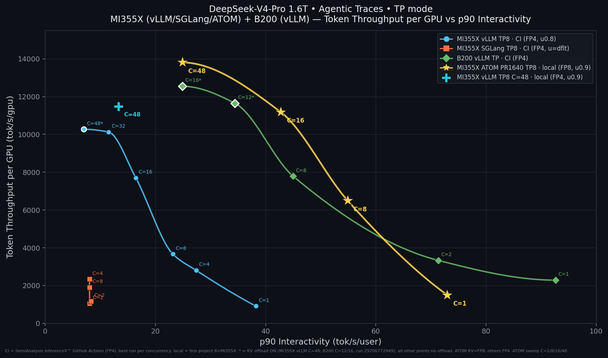

# DeepSeek-V4 Agentic Benchmark (MI355X)

This recipe documents the **agentic-replay** performance of DeepSeek-V4-Pro on
8×MI355X and how to reproduce ATOM's numbers. The workload is the SemiAnalysis
InferenceX™ *agentic traces* scenario (AIPerf `inferencex-agentx-mvp`, public
dataset `semianalysis_cc_traces_weka_062126`): huge, highly prefix-cacheable
prompts (~135k tokens) with short completions (~850 tokens), replayed
closed-loop. It stresses **prefix-cache retention** — what the paged-SWA
sparse-checkpoint feature in this PR targets.



**Sources & settings**
- **CI** rows = SemiAnalysis InferenceX™ dashboard (GitHub Actions), FP4 weights,
  **best run per concurrency** (the dashboard has repeated runs per config).
  Utilization from the CI benchmark scripts: **vLLM `--gpu-memory-utilization
  0.8`**; **SGLang unset (engine default `mem-fraction-static`)**. Live page:
  https://inferencex.semianalysis.com/inference (DeepSeek-V4-Pro · MI355X · FP4 ·
  Agentic · p90).
- **local** rows = this project, 8×MI355X, **`--gpu-memory-utilization 0.9`**.
- Chart axes: Y = tput/GPU (tok/s/gpu), X = p90 interactivity (tok/s/user);
  point labels = concurrency (C). **Pure TP8 only — DP-attention (DPA) configs
  are excluded.**

### CI data provenance
Read from the SemiAnalysis dashboard API (`/api/v1/benchmarks?model=DeepSeek-V4-Pro`,
filtered `hardware in {mi355x,b200}, benchmark_type=agentic_traces, precision=fp4,
decode_dp_attention=false`, best run per concurrency). Each series comes from a
single GitHub Actions run (B200 = run 29706772949, conc 1/2/8/12/16):

| Series | Date | Server image | GitHub Actions run |
|---|---|---|---|
| vLLM TP8 (CI) | 2026-07-09 | `vllm/vllm-openai-rocm:nightly-09663abde0f5…` | https://github.com/SemiAnalysisAI/InferenceX/actions/runs/28911223583/attempts/3 |
| SGLang TP8 (CI) | 2026-07-16 | `lmsysorg/sglang-rocm:v0.5.14-rocm720-mi35x-20260710` | https://github.com/SemiAnalysisAI/InferenceX/actions/runs/29413860950/attempts/3 |
| B200 vLLM TP (CI) | 2026-07-21 | `vllm/vllm-openai:nightly-dev-x86_64-cu13.0.1-904e4ec` | https://github.com/SemiAnalysisAI/InferenceX/actions/runs/29706772949/attempts/3 |

Interactive dashboard (all vendors/frameworks, updated continuously):
https://inferencex.semianalysis.com/inference

## MI355X vLLM — CI (FP4, util 0.8, TP8)
| Conc | tput/GPU | p90 intvty | p90 TTFT | p90 E2E |
|--:|--:|--:|--:|--:|
| 1 | 911 | 38.23 | 3.99 s | 79.0 s |
| 4 | 2,802 | 27.40 | 2.15 s | 100.4 s |
| 8 | 3,662 | 23.17 | 2.20 s | 106.6 s |
| 16 | 7,705 | 16.44 | 2.79 s | 126.2 s |
| 32 | 10,128 | 11.49 | 3.26 s | 154.8 s |
| 48 | 10,273 | 7.01 | 4.96 s | 217.5 s |

## MI355X SGLang — CI (FP4, util = engine default, TP8)
| Conc | tput/GPU | p90 intvty | p90 TTFT | p90 E2E |
|--:|--:|--:|--:|--:|
| 1 | 1,057 | 8.08 | 31.35 s | 113.4 s |
| 2 | 1,170 | 8.34 | 3.64 s | 251.1 s |
| 4 | 2,338 | 8.03 | 1.65 s | 201.6 s |
| 8 | 1,906 | 8.04 | 1.25 s | 164.6 s |

(SGLang's pure-TP8 interactivity saturates ~8 tok/s/user; its high-throughput
DP-attention configs are intentionally excluded here.)

## B200 vLLM — CI (FP4, TP) — cross-hardware reference (NVIDIA)
Single CI run `29706772949` (2026-07-21), conc 1/2/8/12/16. **KV offload is ON
for C=12/16** (only variant in that run); C=1/2/8 are no-offload.

| Conc | tput/GPU | p90 intvty | p90 TTFT | p90 E2E | offload |
|--:|--:|--:|--:|--:|:--:|
| 1 | 2,284 | 92.59 | 1.54 s | 33.0 s | off |
| 2 | 3,330 | 71.33 | 3.79 s | 34.7 s | off |
| 8 | 7,791 | 44.98 | 0.93 s | 49.1 s | off |
| 12 | 11,653 | 34.44 | 1.04 s | 51.7 s | **on** |
| 16 | 12,552 | 24.88 | 1.50 s | 74.1 s | **on** |

B200 (NVIDIA) reaches much higher interactivity than MI355X (faster per-GPU),
peaking ~11.7–12.6k tok/s/gpu at C=12/16 (**with KV offload**). At the same
interactivity (~24.9), **MI355X ATOM PR1640 C=48 = 13.8k tok/s/gpu, no offload,
edges out B200 vLLM C=16 = 12.6k (offload on)**. FP4 weights; DP-attention
excluded.

## c48 head-to-head — agentic, TP8 (all DSV4-Pro, EP1, c=48)

All DSV4-Pro, TP8, EP1, c48. The SA-CI and Local-vLLM rows are copied from the
"Unified Completed-Run Comparison" table in
[`dsv4_agentic_baseline_record.md`](../dsv4_agentic_baseline_record.md)
(vLLM FP8 / Atom BF16, no sparse fix — for those prior columns); the ATOM row is
this PR (FP8 KV, sparse-32k retention).

| Run | Source | util | KV | req/s | tput/GPU | input tok/s | output tok/s | TTFT p50 | ITL p50 | E2E p50 | realized prefix hit |
|---|---|--:|---|--:|--:|--:|--:|--:|--:|--:|--:|
| SA CI vLLM 0.8 | CI¹ | 0.8 | FP8 | 0.291 | 4,582 | 36,458 | 197.6 | 1.60 s | 155 ms | 74.26 s | ~80% (late) |
| Local vLLM 0.8 | local | 0.8 | FP8 | 0.102 | 1,623 | 12,932 | 49.4 | 215.35 s | 644 ms | 399.09 s | ~21% (late) |
| Local vLLM 0.9 | local | 0.9 | FP8 | 0.658 | 11,479 | 91,279 | 549.8 | 0.89 s | 89 ms | 37.21 s | ~95–96% (late) |
| **ATOM PR1640 (this PR)** | local | 0.9 | FP8 | **0.776** | **13,816** | 109,848 | 680.4 | 1.99 s | 54.7 ms | 28.61 s | **~94% (95–96% ss)** |

¹ **SA CI vLLM 0.8** = SemiAnalysis InferenceX™ GitHub Actions run `28911223583`
(job `85827993439`, InferenceX rev `d0de4a3b`, runner `mi355x-amds_02`):
https://github.com/SemiAnalysisAI/InferenceX/actions/runs/28911223583/attempts/3

`tput/GPU` = total token throughput ÷ 8. `realized prefix hit`: vLLM = server
late-profile prefix metric (approximate); ATOM = `ATOM_DEBUG_PREFIX_HITS`
CacheStats (ss = steady-state). ATOM PR1640 (TP8, C=48) lands at **13.8k
tok/s/gpu** — above local vLLM 0.9 (11.5k) and the SA-CI/0.8 runs — at
comparable/better latency, with realized prefix-cache hit ~94% (vs 13% pre-fix).

## ATOM PR1640 concurrency sweep (local, TP8, FP8 KV, util 0.9)

The gold curve in the chart. Same config at each concurrency (sparse-32k SWA
retention, full 3600 s profile, `AIPERF_HTTP_TCP_USER_TIMEOUT=900000`). Higher
concurrency → higher aggregate throughput/GPU but lower per-user interactivity.

| Conc | req/s | tput/GPU | input tok/s | output tok/s | TTFT p50 | ITL p50 | p90 intvty | realized prefix hit | errors |
|--:|--:|--:|--:|--:|--:|--:|--:|--:|--:|
| 1 | 0.039 | 1,495 | 11,906 | 53.7 | 1.42 s | 16.1 ms | 72.96 | 96.9% | 0/142 |
| 8 | 0.388 | 6,497 | 51,627 | 351.6 | 1.05 s | 22.6 ms | 54.88 | 96.4% | 0/1408 |
| 16 | 0.501 | 11,182 | 88,982 | 471.5 | 1.32 s | 29.8 ms | 42.76 | 96.4% | 1/1825 |
| 48 | 0.776 | 13,816 | 109,848 | 680.4 | 1.99 s | 54.7 ms | 24.9 | 94.1% (95–96% ss) | 2/2825 |

Higher concurrency → higher aggregate tput/GPU but lower per-user interactivity.
Realized prefix hit stays ~96–97% at C=1/8/16 and ~94% at C=48 (lower concurrency
= less live-window churn, so more checkpoints survive). All errors ≤ 0.06%.

## How to run

### Prerequisites
- 8×MI355X (gfx950). FP8 KV requires gfx950/gfx1250.
- Docker/podman image: `docker.io/rocm/atom-dev:latest` (used here:
  `sha256:4fe5d5f7dd9580e4a524edf6d1976e7c3f312737be9ae8b615c058ba452b5d04`).
- Model at `/shared/data/amd_int/models/DeepSeek-V4-Pro` (mounted read-only).
- The InferenceX agentic harness (AIPerf `inferencex-agentx-mvp`) checkout,
  mounted at `/inferencex` (provides `benchmark_lib.sh` + the aiperf CLI).
- ATOM source: this PR's branch merged onto latest `main`, bind-mounted over the
  image's `/app/ATOM/atom` (pure-Python; no rebuild). Merging `main` in is
  required so the mounted tree also carries `main`'s FP8 KV support.

### Step 1 — launcher (`run_atom_agentic.sh`): start a fresh container
Starts a rootless podman container with host networking + GPUs, mounts the
model / harness / merged ATOM source, and runs the in-container driver.
```bash
#!/usr/bin/env bash
set -euo pipefail
ROOT_DIR="$(cd "$(dirname "$0")" && pwd)"
IMAGE="${ATOM_IMAGE:-docker.io/rocm/atom-dev:latest}"
MODEL_DIR="${MODEL_DIR:-/shared/data/amd_int/models/DeepSeek-V4-Pro}"
INFERENCEX_DIR="${INFERENCEX_DIR:-/path/to/inferencex}"     # agentic harness checkout
ATOM_SRC="${ATOM_SOURCE_OVERRIDE:?point to merged ATOM tree containing atom/}"
RUN_LABEL="${RUN_LABEL:?unique per run}"
CONC=48; DURATION=3600                                      # 'full' agentic profile
mkdir -p "$ROOT_DIR/results/$RUN_LABEL" "$ROOT_DIR/runtime/$RUN_LABEL" "$ROOT_DIR/hf_home"

exec podman run --rm --name "atom_agentic_${RUN_LABEL}" \
  --network host --ipc shareable --shm-size 16g \
  --cap-add SYS_PTRACE --security-opt seccomp=unconfined \
  --group-add keep-groups --device=/dev/kfd --device=/dev/dri \
  -v "$ROOT_DIR:/workspace" \
  -v "$INFERENCEX_DIR:/inferencex:ro" \
  -v "$MODEL_DIR:/data/amd_int/models/DeepSeek-V4-Pro:ro" \
  -v "$ATOM_SRC/atom:/app/ATOM/atom:ro" \
  -e MODEL_PATH=/data/amd_int/models/DeepSeek-V4-Pro -e TP=8 -e EP_SIZE=1 \
  -e CONC="$CONC" -e DURATION="$DURATION" -e PORT=18080 \
  -e MAX_NUM_SEQS=96 -e GPU_MEMORY_UTILIZATION=0.9 -e KV_CACHE_DTYPE=fp8 \
  -e ATOM_SWA_FULL_RETAIN=1 -e ATOM_SWA_RETENTION_INTERVAL=32768 \
  -e ATOM_SWA_CHECKPOINT_FRAC=0.5 -e ATOM_DEBUG_PREFIX_HITS=1 \
  -e RESULT_DIR="/workspace/results/$RUN_LABEL" -e RESULT_FILENAME="$RUN_LABEL" \
  -e AGENTIC_OUTPUT_DIR="/workspace/results/$RUN_LABEL" \
  -e INFMAX_CONTAINER_WORKSPACE=/inferencex \
  -e AGENTIC_DIR=/inferencex/utils/agentic-benchmark -e AIPERF_DIR=/inferencex/utils/aiperf \
  -e AIPERF_RUNTIME_DIR="/workspace/runtime/$RUN_LABEL" \
  -e AIPERF_AGENTIC_CACHE_WARMUP_DURATION=600 -e AIPERF_WARMUP_GRACE_PERIOD=1800 \
  -e HF_HOME=/workspace/hf_home -e PYTHONDONTWRITEBYTECODE=1 \
  "$IMAGE" bash /workspace/atom_agentic_dsv4.sh
```

### Step 2 — in-container driver (`atom_agentic_dsv4.sh`): serve + replay
```bash
#!/usr/bin/env bash
set -euo pipefail
source /inferencex/benchmarks/benchmark_lib.sh
export AITER_BF16_FP8_MOE_BOUND=0 ATOM_MOE_GU_ITLV=1 AITER_LOG_LEVEL=WARNING ATOM_DISABLE_MMAP=true
SERVER_LOG="$RESULT_DIR/atom_server.log"

# 1) start the ATOM OpenAI server (TP8, FP8 KV, sparse-checkpoint retention)
python3 -m atom.entrypoints.openai_server \
  --model "$MODEL_PATH" --server-port "$PORT" -tp "$TP" \
  --kv_cache_dtype "$KV_CACHE_DTYPE" --enable_prefix_caching \
  --max-num-seqs "$MAX_NUM_SEQS" --gpu-memory-utilization "$GPU_MEMORY_UTILIZATION" \
  > "$SERVER_LOG" 2>&1 &
SERVER_PID=$!

# 2) wait until /v1/models responds (fail fast if the server dies)
until curl -sf "http://127.0.0.1:${PORT}/v1/models" >/dev/null; do
  kill -0 "$SERVER_PID" 2>/dev/null || { tail -200 "$SERVER_LOG"; exit 1; }
  sleep 5
done

# 3) run the agentic replay (600s cache-pressure warmup + 3600s profile)
resolve_trace_source; install_agentic_deps; build_replay_cmd "$RESULT_DIR"
REPLAY_CMD+=" --warmup-grace-period ${AIPERF_WARMUP_GRACE_PERIOD}"
run_agentic_replay_and_write_outputs "$RESULT_DIR"   # -> $RESULT_DIR/$RESULT_FILENAME.json
```
The replay `build_replay_cmd` expands to:
```bash
aiperf profile --scenario inferencex-agentx-mvp \
  --url http://localhost:18080 --endpoint /v1/chat/completions --endpoint-type chat --streaming \
  --model /data/amd_int/models/DeepSeek-V4-Pro \
  --concurrency 48 --benchmark-duration 3600 --random-seed 42 \
  --agentic-cache-warmup-duration 600 --warmup-grace-period 1800 \
  --public-dataset semianalysis_cc_traces_weka_062126 --num-dataset-entries 393 \
  --output-artifact-dir "$RESULT_DIR/aiperf_artifacts"
```

### Step 3 — one-line invocation (exactly what produced the PR1640 row)
```bash
ATOM_IMAGE=docker.io/rocm/atom-dev:latest \
ATOM_SOURCE_OVERRIDE=$PWD/ATOM \
GPU_MEMORY_UTILIZATION=0.9 KV_CACHE_DTYPE=fp8 \
ATOM_SWA_FULL_RETAIN=1 ATOM_SWA_RETENTION_INTERVAL=32768 ATOM_SWA_CHECKPOINT_FRAC=0.5 \
ATOM_DEBUG_PREFIX_HITS=1 \
RUN_LABEL=atom_pr1640_agentic_fp8_tp8_c48_mem90_int32k_$(date +%Y%m%d) \
bash ./run_atom_agentic.sh full
```

### vLLM baseline (for the head-to-head; separate container, port 18081)
The Local vLLM rows were produced with `run_ci_vllm_agentic.sh` (a separate
container running the SemiAnalysis CI vLLM script), then the same AIPerf replay:
```bash
vllm serve /data/amd_int/models/DeepSeek-V4-Pro \
  --served-model-name deepseek-ai/DeepSeek-V4-Pro --host 0.0.0.0 --port 18081 \
  --trust-remote-code --async-scheduling --distributed-executor-backend mp \
  --kv-cache-dtype fp8 --tensor-parallel-size 8 --data-parallel-size 1 \
  --gpu-memory-utilization 0.9 --moe-backend aiter \
  --compilation-config '{"mode":3,"cudagraph_mode":"FULL_AND_PIECEWISE"}' \
  --tokenizer-mode deepseek_v4 --tool-call-parser deepseek_v4 --reasoning-parser deepseek_v4 \
  --enable-auto-tool-choice --enable-prefix-caching --no-disable-hybrid-kv-cache-manager \
  --max-num-seqs 96
# env: VLLM_ROCM_USE_AITER=1 VLLM_ROCM_USE_AITER_MOE=1 VLLM_PREFIX_CACHE_RETENTION_INTERVAL=32768
# then: same `aiperf profile --scenario inferencex-agentx-mvp ...` against port 18081
```

### Collect results
Per run, under `results/<RUN_LABEL>/`:
`aiperf_artifacts/profile_export_aiperf.json` (throughput / TTFT / ITL / e2e /
theoretical hit), `atom_server.log` (startup geometry + realized-hit CacheStats
when `ATOM_DEBUG_PREFIX_HITS=1`), `benchmark.log`, `gpu_metrics.csv`, and the
aggregated `<RUN_LABEL>.json`.

## Notes
- **FP8 KV requires gfx950/gfx1250** (MI355X = gfx950); else BF16 fallback.
  FP8 packs ~35–44% more KV blocks than BF16 at equal budget.
- CI utilization is read from the InferenceX CI scripts (not exposed in the
  dashboard data): vLLM 0.8, SGLang engine default. Local runs use 0.9.
- ATOM interactivity = p90 of AIPerf per-user output-token throughput (same
  harness family as the dashboard `p90_intvty`).
- Agentic replay is **closed-loop** (±5–10% run-to-run); compare absolute
  throughput/interactivity, not input:output token ratios.
